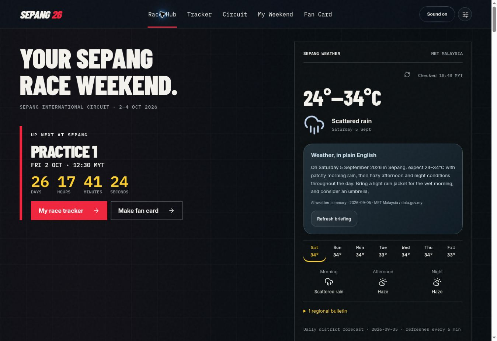
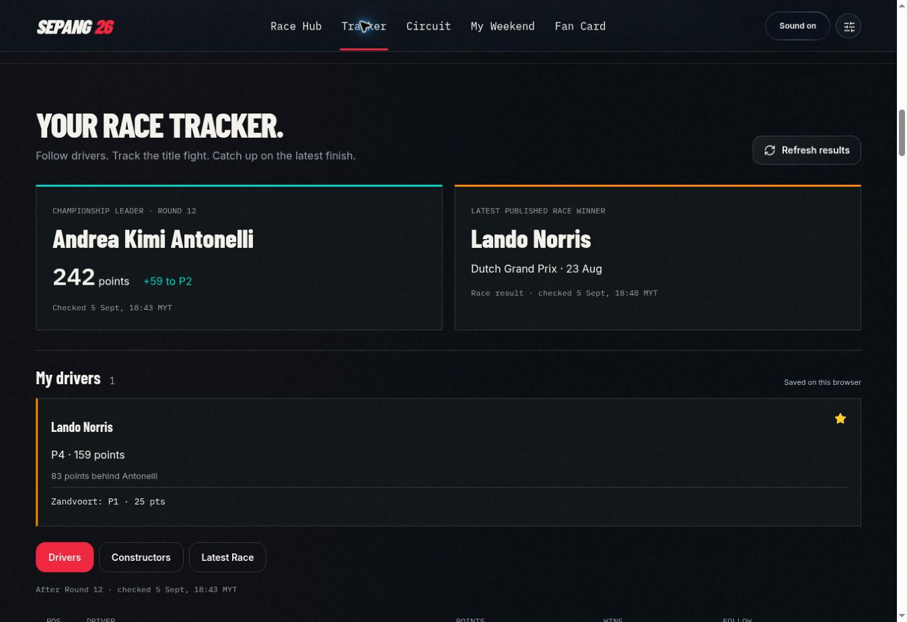
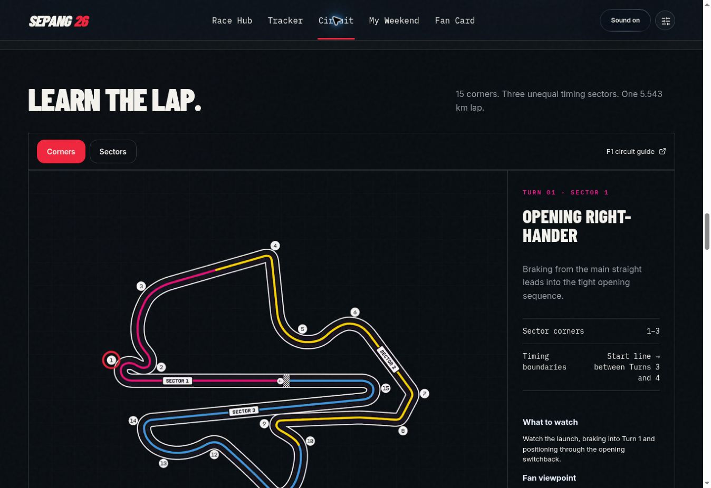
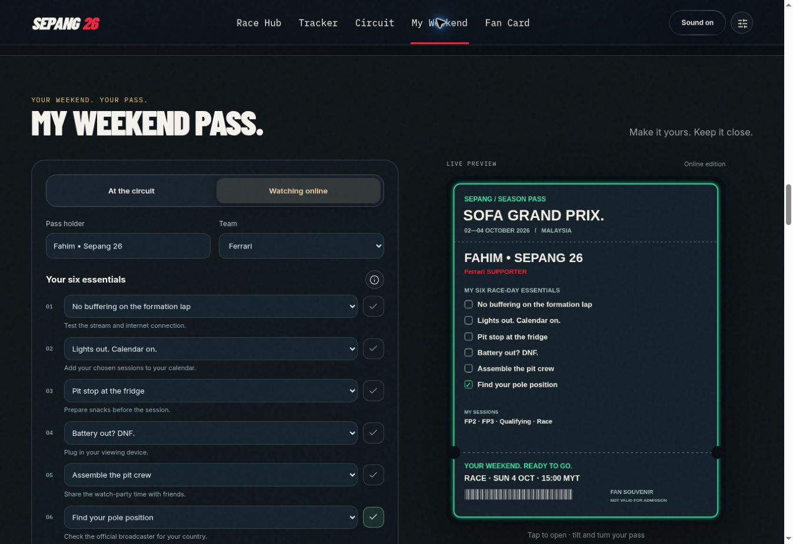
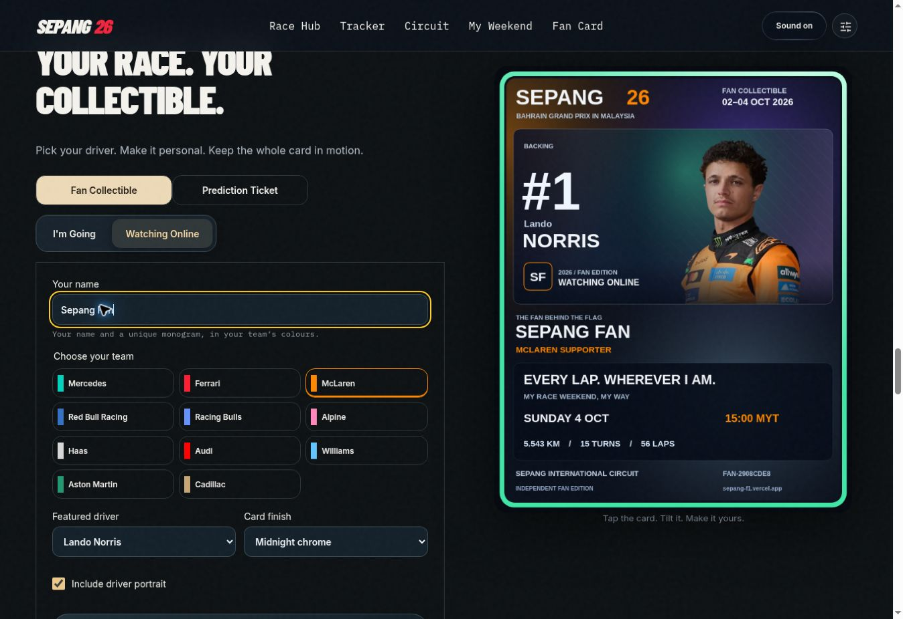
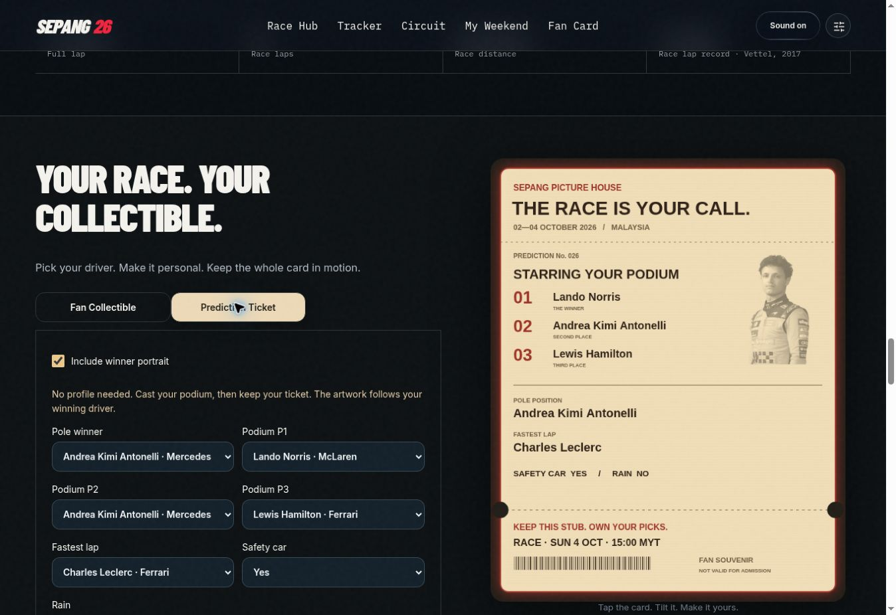
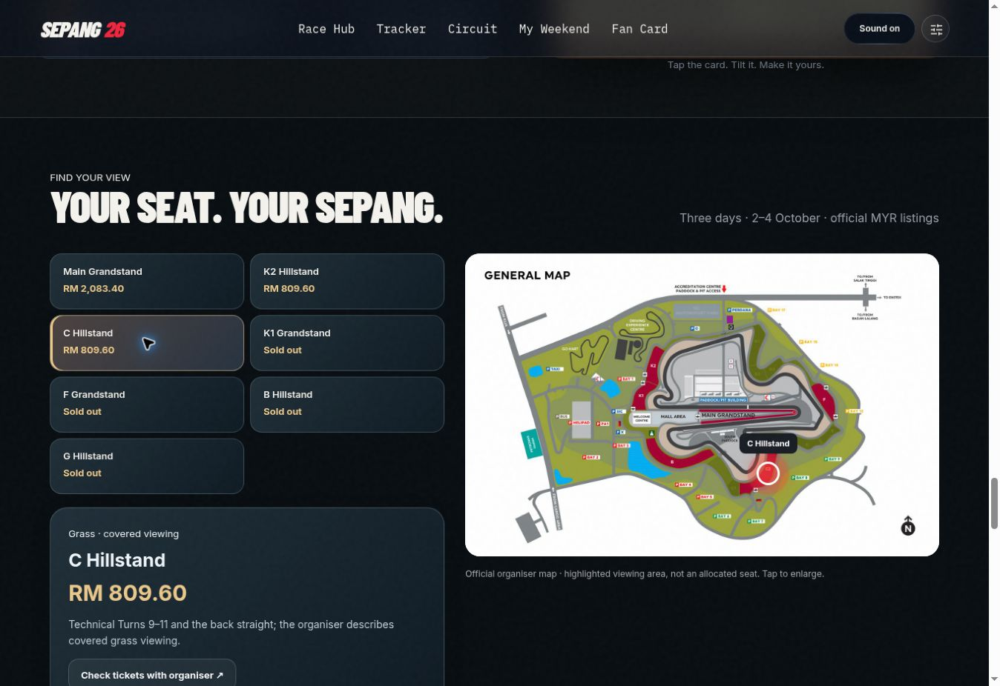

# Sepang 26 — Race Weekend Companion

[**Open the live app →**](https://sepang-f1.vercel.app/)

A no-login fan companion for the Formula 1 Gulf Air Bahrain Grand Prix in Malaysia at Sepang, 2–4 October 2026. Personal preferences, weekend plans, driver follows and collectibles save in the current browser.

## Features

- **Race hub:** countdown, Malaysian session times, calendar export and scheduled session progress.
- **Weather:** MET Malaysia district forecasts and regional bulletins through data.gov.my, with optional AI summaries.
- **Personal race tracker:** favourite drivers, championship standings, recent form and latest published race results.
- **Circuit guide:** official circuit diagram, selectable corners and sectors, manual navigation and AI circuit explanations.
- **Weekend pass:** compact form, six prefilled essentials, ready status, live preview and PNG/GIF/MP4/PDF exports.
- **Collectibles:** team-themed trackside/online fan cards, interactive tilt-and-flip viewer, and vintage prediction tickets with real driver choices and unique podium selections.
- **Visit & tickets:** official MYR price snapshots, viewing-area highlights, OpenStreetMap navigation and directions.
- **Sepang archive:** chronological history with source links and paginated chapter reading.
- **Audio:** Zen UI effects and Paddock Pulse background music, with separate controls and master mute.

## Screenshots

Captured from the public app on 5 September 2026. Names and predictions shown are demonstration choices. Weather, results and prices are point-in-time screenshots, not promises of current conditions or availability.

### Race hub & weather



### Personal race tracker



### Interactive circuit guide



### Weekend pass editor



### Fan collectible



### Prediction ticket



### Ticket prices & viewing areas



## Run locally

```bash
npm ci
npm run dev
```

```bash
npm run build
npm run preview
```

Built with React and Vite. Canvas rendering is shared by the live cards and downloads. GIF encoding uses gifenc; MP4 encoding uses Mediabunny/WebCodecs and requires a compatible browser. OpenLayers provides the geographic map.

## AI setup & deployment

The public app deploys on Vercel from this repository's `main` branch. Build command: `npm run build`. Output directory: `dist`.

Set **`OPENROUTER_API_KEY`** as a private Vercel environment variable, then redeploy. The server-side endpoint in `api/briefing.js` uses **`minimax/minimax-m3:free`**. Never put the key in frontend code, a `VITE_` variable, screenshots or commits.

Vite alone does not run the Vercel API function. Use Vercel's development environment or a Vercel deployment to test AI responses. Without the secret or when the provider is unavailable, the app displays an error and retry control.

## Data freshness

| Data | Behaviour |
| --- | --- |
| MET forecasts and bulletins | Refresh every 5 minutes while visible and when returning to the tab. Forecast publication is controlled by MET. |
| Latest race results | Refresh every 5 minutes. Published classifications, **not lap-by-lap live timing**. |
| Championship standings | Refresh every 30 minutes while visible. |
| Session progress | Follows the device clock and published timetable; race duration is a planning window. |
| Schedule, tickets, circuit facts and archive | Source-checked content. Requires an update when official information changes. |
| Personal plans and cards | Browser local storage; no account or cross-device sync. Download files to keep or share them. |

Feeds retain previously fetched data on failure and display update errors. Forecast temperatures are daily predictions, not trackside sensor readings. Screenshots are documentation assets and do not update automatically.

## Sources

- [Official Formula 1 event timetable](https://www.formula1.com/en/racing/2026/bahrain)
- [Sepang International Circuit](https://www.sepangcircuit.com/home)
- [Official ticket information](https://www.bahraingp.com/blog/events/ticket-information/)
- [MET data through data.gov.my](https://api.data.gov.my/weather/forecast/)
- [Jolpica F1 results API](https://github.com/jolpica/jolpica-f1)
- [OpenStreetMap](https://www.openstreetmap.org/)

Independent fan project. Not affiliated with Formula 1 or the event organisers. Collectibles and weekend passes are souvenirs, not admission tickets. Official photographs, driver portraits and circuit maps retain their respective owners' rights.
